**Stealth Calculator
**
A Casio calculator with a Raspberry Pi put inside!

IMPORTANT NOTE FOR REVIEWERS, I ACCIDENTALLY PUT THIS AS TIER 2 WHEN IT'S A TIER 3 PROJECT THAT HAS A TOTAL COST OF $94.48 USD!

What is the project?
My stealth calculator is a calculator (Casio FX-991ESPLUS2), with the insides completely gutted out. Inside, it holds a Raspberry Pi Zero 2W as the main brain and a Raspberry Pi Pico 2 as a dedicated input controller. It utilizes matrix scanning to scan the custom PCB's rows and columns waiting for an input, and has the buttons mapped out. It has a 2.4 colour OLED touchscreen for easy usage and an integrated camera that's low profile, which allows the calculator to view the world, allowing for more functionality later on if I want to add other features.

How do I use it?
The device functions as a standard calculator, but by entering a special code (not sure what this will be I need to have the physical Pi to mess around with it), the user will switch from the standard Casio interface to a fully seperate menu. They may then use the integrated camera to take a photo of a math problem to recieve homework help, which is processed via the Gemini AI API to send the answers back to the calculator. It has built in WIFI, so to use at school you can just connect to your phone's hotspot for the best connection. It also constantly pulls updates from the repo, so you just need to clone it once, then it will update every few minutes (or longer depending if you want my new feature releases).

How do you build this yourself?
Just order all the parts on my BOM, and also order the PCB files. Unscrew open the calculator, and you will be able to lift off the board and attached screen.
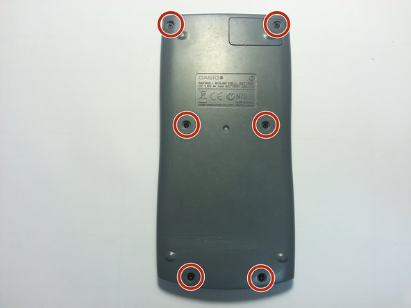
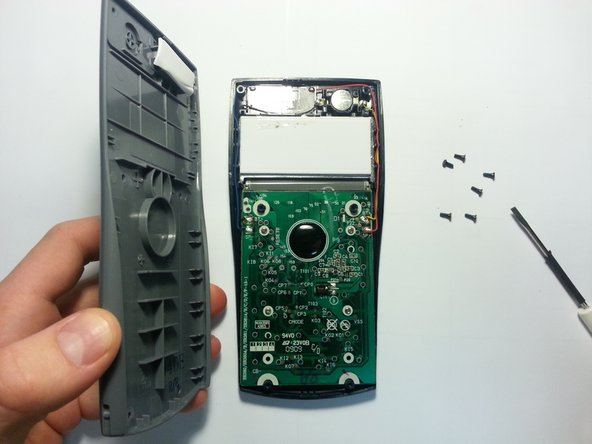

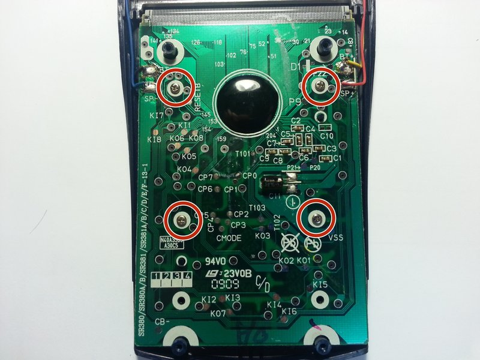
In the calculator found in the BOM (these photos are from the web), the circled screws are actually hard pieces of plastic you have to snap. Aggresively pry the board out without breaking anything below (snap the board idc).

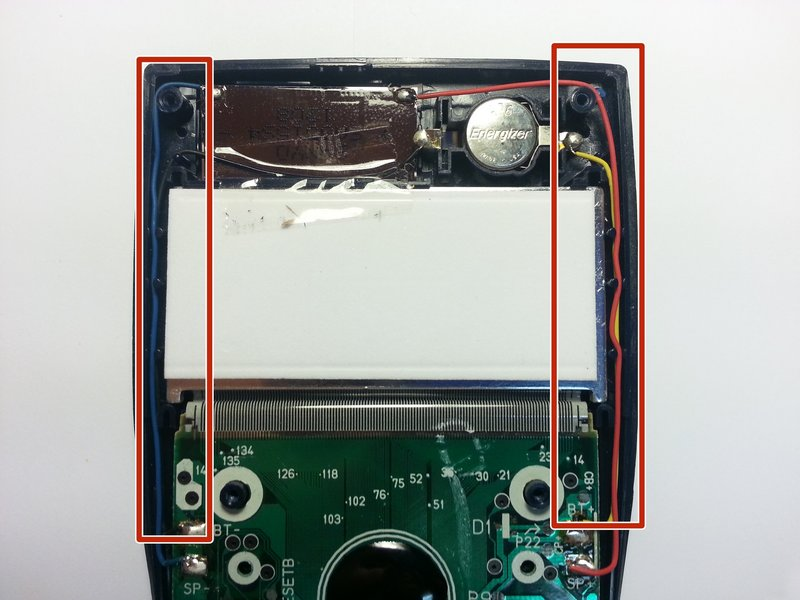

I really don't care if you break the PCB or screen or anything, just make sure to save this conductive rubber pad,:
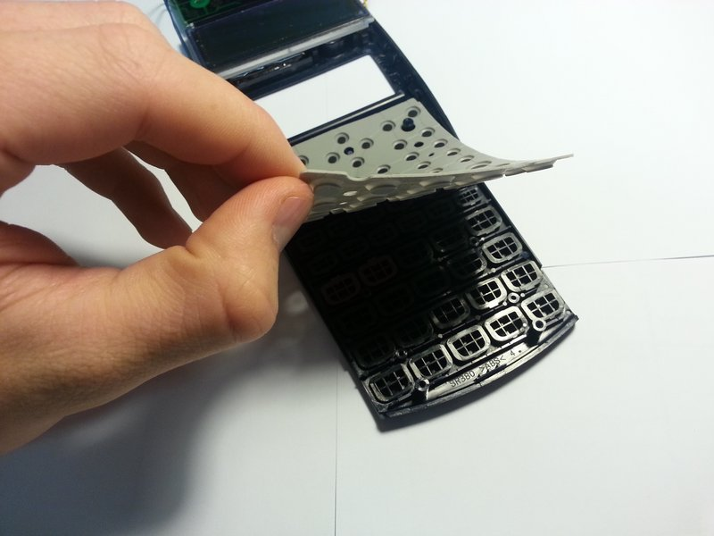

Oh also make sure the buttons don't fall out that will irritate you (I did this myself it's so annoying).
All that should be saved is the solar panel from the top (to glue back in place), the buttons, the pad, and the top shell half and bottom shell half.

Your parts should look something like this (don't lose the screws like I did)
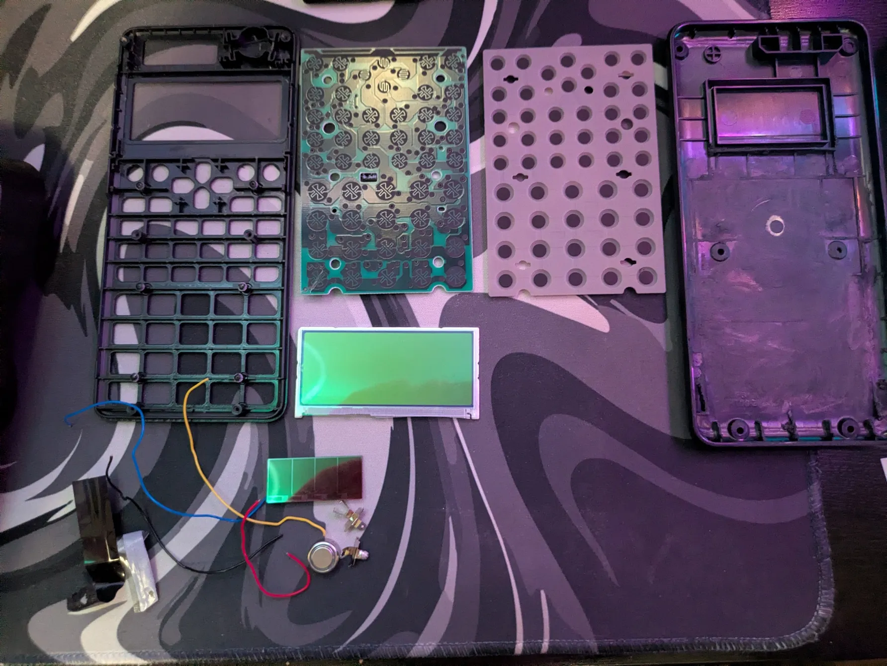

In the back of the calculator there's plastic parts, you will need to use a smal rotating saw or a mechanical sander to hollow out the shell, make sure not to touch other parts of the back shell and use this reference image:
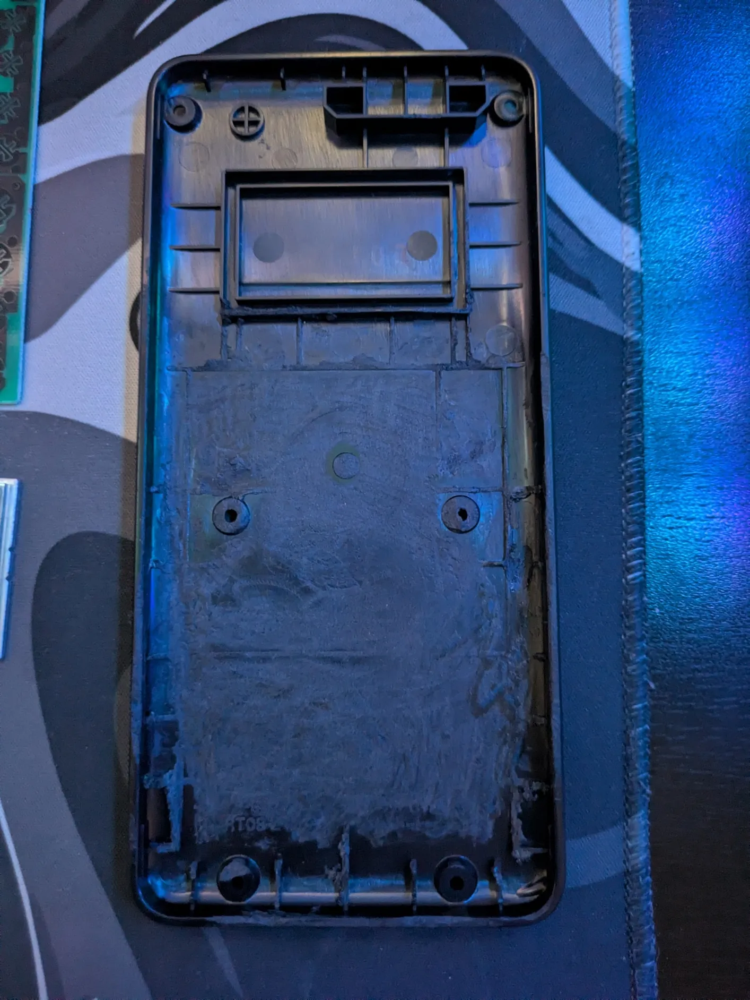

I haven't done these steps yet but when I get the parts it should go something like this:
SOFTWARE:
SET UP PI WITH MY REPO (CLONE IT)
Install screen drivers: Follow these steps: https://www.lcdwiki.com/2.4inch_RPi_Display_For_RPi_3A+#How_to_use_with_Raspberry_Pi_OS

1. Solder the battery to the boost board battery terminals, and the outputs to the Pi Zero 2W according to the schematic.
2. Desolder the hat attached to the screen, and then solder wires from the pins on the screen to the Pi Zero 2W.
3. Then solder all the row and column pads from the PCB to the Pico and solder the Pico to the Pi Zero 2W (again follow schematic).
4. Place screen where it belongs, glue in place and put the battery flat on top near the bottom (it's thin and long and wide).
5. Make sure both Pis do not touch any metal parts so they don't get short circuited (use heat resistance tape).
6. The repo should update and pull my code, I'm going to perfect it once I get the parts.

Why did I make this?
I just chose to make this because it turns out it's REALLY hard to do this without having extensive PCB design knowledge. To cram that many parts inside is insane when you're not making an all in one PCB. It's various components that you need to carefully account for in terms of space.

FINAL PICTURES:

{KICAD SCHEMATIC}

PCB DESIGN:
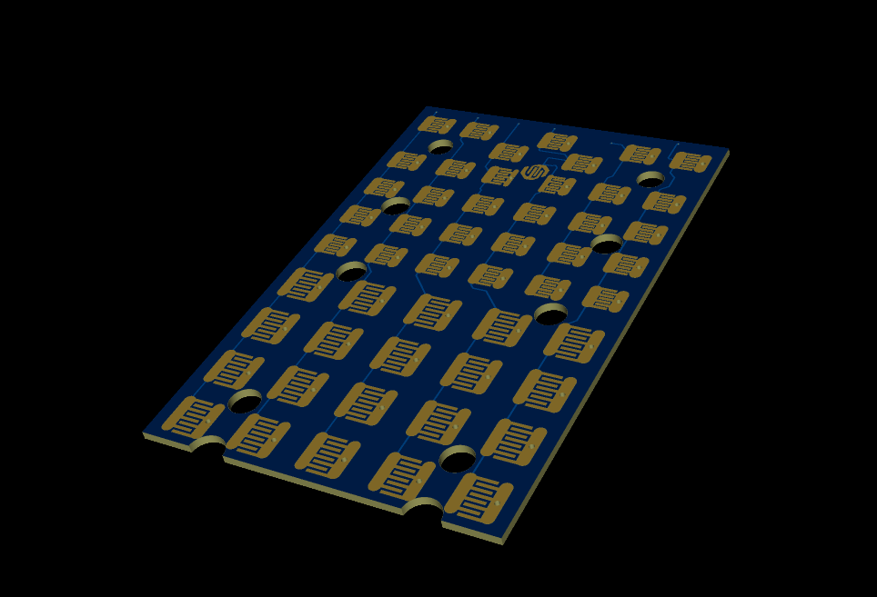

PCB ROWS AND COLUMNS:

Matching Calculator Rows and Columns:
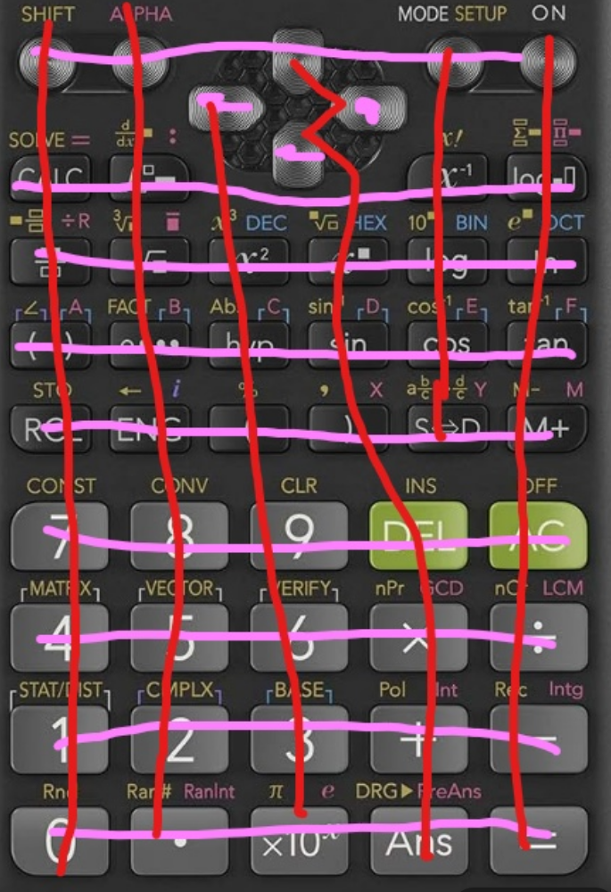

IMPORTANT!!! HERE ARE THE COLUMN AND ROW LABELS!!!!
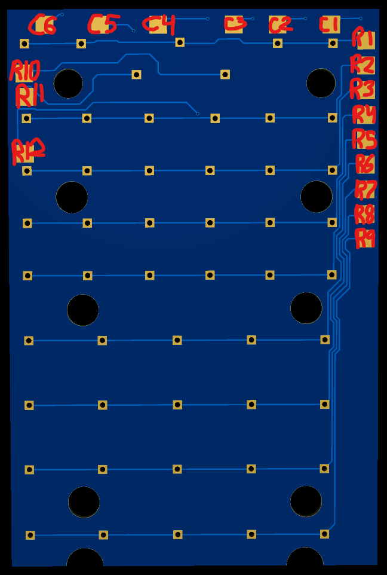
Here's the column (C) and row (R) labels, to follow the schematic diagram when wiring to the Pico.

PCB FRONT VIEW
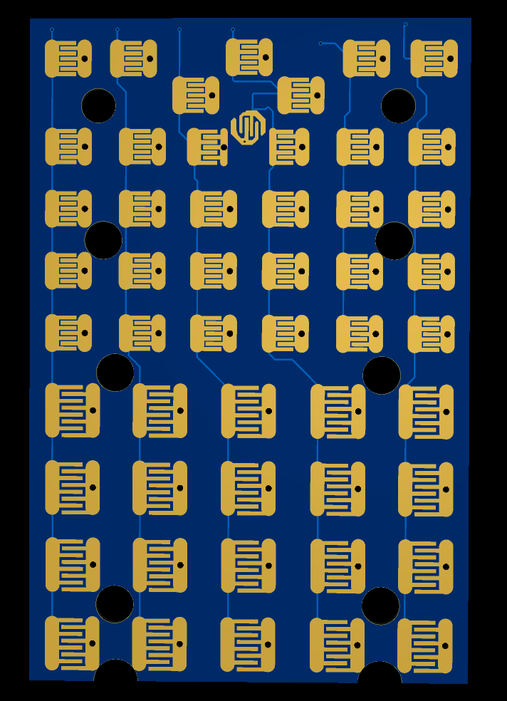

PCB BACK VIEW
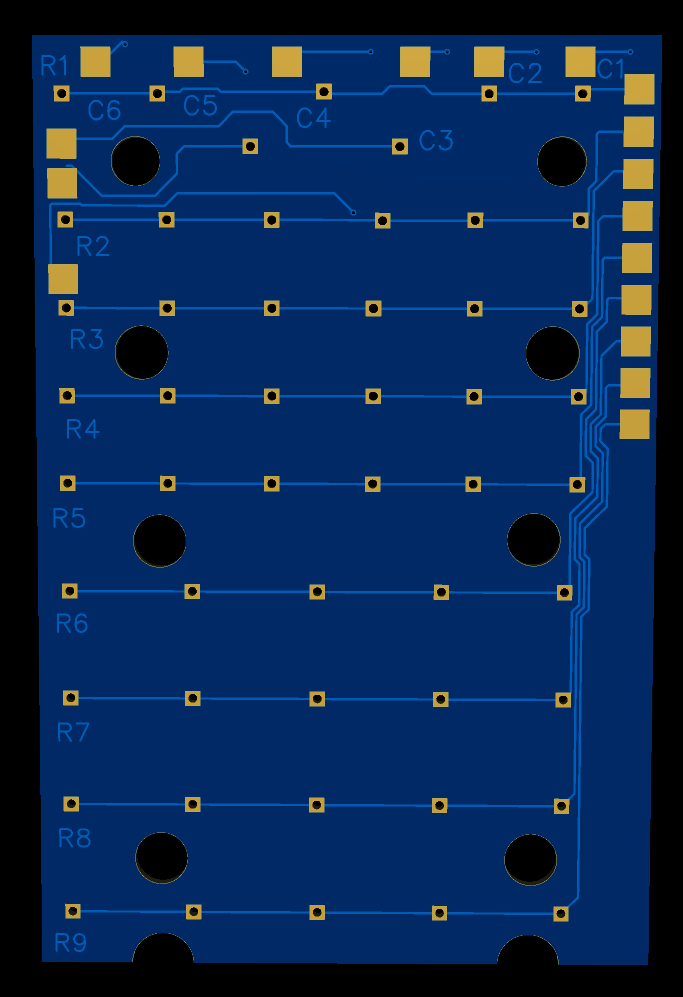

Features that are currently planned as soon as I get the parts:
-PDF and Image viewer.
-RetroPie abilities for Games.
-Camera with a button that automatically takes a picture and sends the request to Gemini saying answer this, then the response is sent back and display on the screen.

Tell me more features to add!!!!
As of March 31, 2026 the firmware should be useable, but will be modified with features once the parts are obtained!!!

Thanks for reading, stay tuned for the build!
